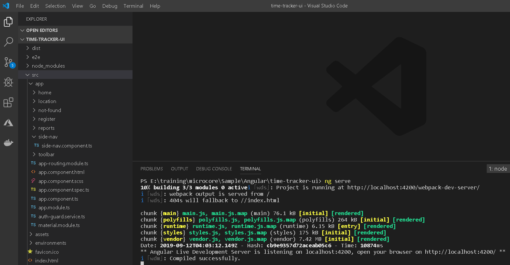
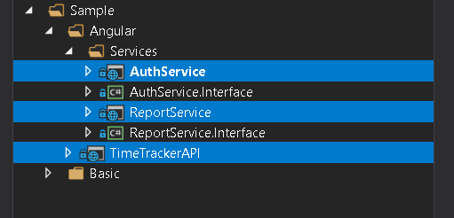
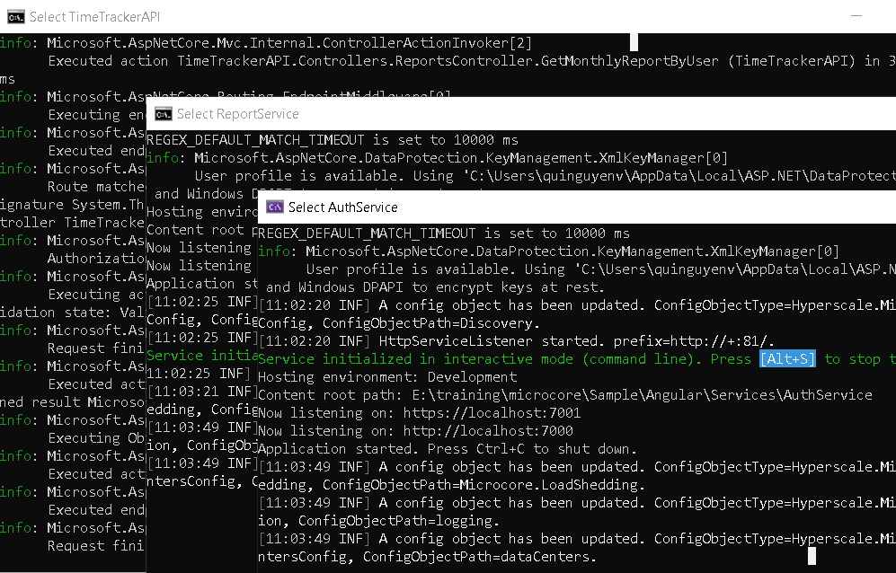
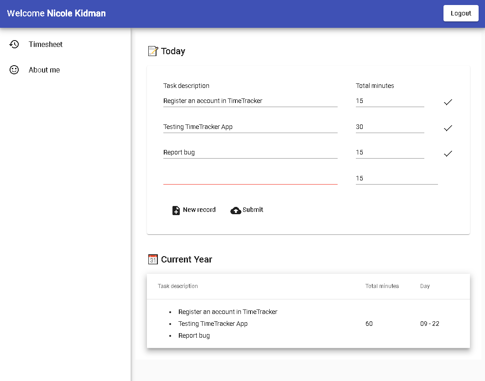

# Introduction

This is demonstration of basic example of single page angular application and microservice architecture.
Angular application uses adal-angular4 to authenticate Azure Active Directory users. 
You can use sample users 
- dev0001@quioutlookcom.onmicrosoft.com/HVN@Welc0meHVN@Welc0me
- dev0002@quioutlookcom.onmicrosoft.com/HVN@Welc0meHVN@Welc0me

The backend side, we use simple API Gateway which is implemented by ASP.Net Core 2.2 Web API and there are two small microservices, ReportService and AuthService. 

After login, click on ***Timesheet*** menu to retrieve data from server. Here is the data flow:
angular application -> API Gateway -> ReportService (to retrieve fake report data) -> AuthService (to fullfil user name and email for report data).

The database access and ***Register*** feature to demo auto-register user in Azure Active Directory is comming soon.

The commnunication between microservices is asynchronous HTTP and is handled by https://github.com/quinvit/microcore library. The library covers network call, serialization/deserialization, contract mapping. We only use microservice by using DI to inject service interface to constructor as in-process service injection.

# Contents

1. time-tracker-ui folder contains sample code of angular application.
2. TimeTrackerAPI folder contains sample code of API Gateway
3. Services folder contains sample code of two simple microservices.

In angular frontend, we simply use adal-angular4 library to authenticate against Azure Active Directory users and auto-attach jwt bearer token when we call any API using HttpClient.
```
@Component({
    selector: 'app-reports',
    templateUrl: './reports.component.html',
    styleUrls: ['./reports.component.css']
})
export class ReportsComponent implements OnInit {

    displayedColumns: string[] = ['name', 'totalMinutes', 'dayInMonth', "email"];
    dataSource = ELEMENT_DATA;

    constructor(private http: HttpClient) { }

    ngOnInit() {
        this.http.get<DailyTimeSheetByUser[]>(`${environment.config.apiGateway}/api/Reports/MonthlyReportByUser`)
        .subscribe(x => {
            this.dataSource = x;
        });
    }
}
```
For more detail about this library, please take a look at this article https://adrianszen.com/2019/02/19/angular-with-azure-active-directory-authentication-adal-angular4/.

To start angular application, type ***ng serve*** in terminal.



Register micro-services in Discovery.config:
```
<?xml version="1.0" encoding="utf-8" ?>
<configuration>
  <Discovery>
    <Services>
      <ReportService Source="Config" Hosts="localhost:80" />
      <AuthService Source="Config" Hosts="localhost:81" />
      
      <!--<ReportService Source="Config" Hosts="timetracker-reportservice.azurewebsites.net:80" />
      <AuthService Source="Config" Hosts="timetracker-authservice.azurewebsites.net:80" />-->
    </Services>
  </Discovery>
</configuration>
```

This is how micro-services are integrated to ASP.NET Core (Startup.cs):
```
public Startup(IConfiguration configuration)
{
    ...
    StandardKernel = new StandardKernel();
    StandardKernel.Load<MicrocoreModule>();
    StandardKernel.Load<SerilogModule>();
}
```
```
public void ConfigureServices(IServiceCollection services)
{
    ...
    services.AddTransient((o) => StandardKernel.Get<IReportService>());
    services.AddTransient((o) => StandardKernel.Get<IAuthService>());
}
```

The backend API code in API Gateway:
```
[Authorize]
[Route("api/[controller]")]
[ApiController]
public class ReportsController : ControllerBase
{
    private IReportService _reportService;

    public ReportsController(IReportService reportService)
    {
        _reportService = reportService;
    }

    // GET: api/Reports
    [HttpGet]
    [Route("MonthlyReportByUser")]
    public async Task<DailyTimeByUser[]> GetMonthlyReportByUser()
    {
        var token = await this.HttpContext.GetTokenAsync("access_token");
        return await _reportService.GetMonthlyReportByUserAsync(token);
    }
}
```

To start backend API Gateway and micro-services at local, just run these projects in Visual Studio 2019:



Here is how it works:



Finally, after login to demo users, this is how the application looks like:



The API Gateway and micro-services are deployed to Azure Web App (Linux docker container mode) in order we can easily scale up or scale out any service. On the other hand, hosting microservice in Azure Web App is much cheaper than on VM or AKS. For the angular dist, we simply put all output files of ***ng build --prod*** result to an Azure Storage with enabled Static Website feature.

# Deploy and demo


[Online demo](https://quinvit.z23.web.core.windows.net)
